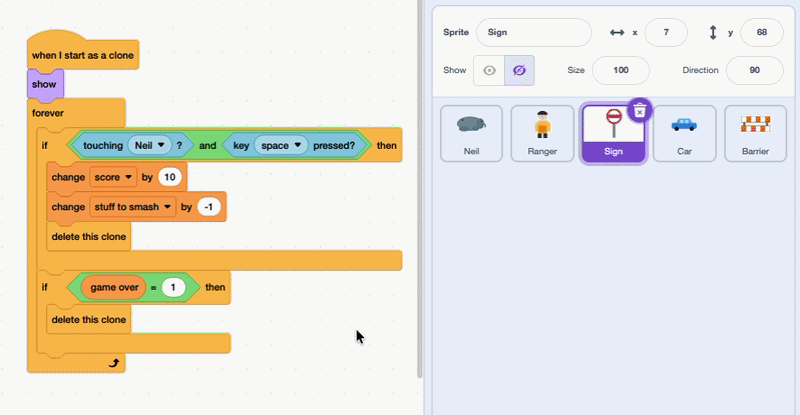

## Add cars and barriers

In this step, you'll add cars and barriers for Neil to smash too. Instead of coding them from the beginning, you'll reuse the code you wrote for the stop signs.

> [!TASK]
>
> Click on the **Sign** sprite. Drag each of its two scripts onto the **Car** sprite in the Sprite list, then onto the **Barrier** sprite, to copy the code across.
>
> Both sprites already have the `create clone of`{:class="block3control"} and `touching`{:class="block3sensing"} blocks pointing at the right things, so the code works straight away.

> [!NOPRINT]
>
> Here's how to copy a script from one sprite to another:
>
> 

> [!TASK]
>
> Click on the **Car** sprite. In the `repeat`{:class="block3control"} loop, change the number to decide how many cars appear around town. It's up to you!
>
> Then do the same on the **Barrier** sprite.

> [!TASK]
>
> Now decide how many points each one is worth. On both the **Car** and **Barrier** sprites, change the number in the `change score by`{:class="block3variables"} block.
>
> Maybe some things are trickier to reach and should be worth more?

> [!TASK]
>
> You can also choose where each type of object appears. In the `go to x: y:`{:class="block3motion"} block, change the `pick random`{:class="block3operators"} numbers to set the area they spawn in — for example, keeping the cars low down so they stay on the road.

Click on the green flag. The town is now full of signs, cars, and barriers for Neil to smash — each worth the points you chose, in the places you picked.
